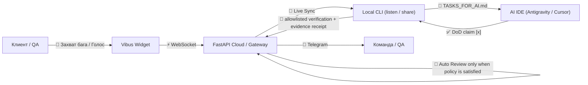

# Vibus: Техническое Задание (Платформа v3)

> 💡 **Бизнес-цель:** Максимально упростить процесс сбора требований, багов и обратной связи от клиента, связав интерфейс приложения напрямую с IDE разработчика, и предоставить безопасный zero-deploy live-туннель с localhost.

## 1. Архитектура системы и жизненный цикл тикета

## 2. Ключевые модули платформы:
- **⚡ Live Preview Туннель (`npx vibus share`):** Мгновенная публикация localhost-сервера разработчика через WebSocket Multiplexer без деплоя на тестовый стенд с авто-инъекцией виджета.
- **📚 Engineering Criteria Contract:** Библиотека 80 канонических критериев и risk-profile presets. `[x]` означает claim исполнителя; для Strict/Critical BLOCKER/HIGH автоматический Review требует verified evidence receipt от allowlisted verifier. Финальная acceptance остаётся за человеком.
- **🤖 Интеллектуальный помощник (BYOK):** Подключение пользовательских ключей API для LLMost (Gemma 2), Groq (Llama 3.3), Ollama, OpenRouter или OpenAI.
- **🛡️ Ссылки доступа с TTL & Single-Use:** Генерация защищенных ссылок для Заказчиков, Тестировщиков и Команды с настраиваемым сроком и одноразовой привязкой к устройству.
- **📱 Мобильный Touch & DOM инспектор:** Захват селектора, стилей, ширины экрана и голосовой надиктованный текст на 4 языках.
- **🌉 CLI Bridge (`npx vibus listen`):** Фоновый процесс синхронизации задач в `.vibus/TASKS_FOR_AI.md`.

## 3. Требования к безопасности (Security & Data Minimization)
- Data minimization / privacy by default: никаких скрытых маркетинговых трекеров и стороннего сбора данных посетителей. В публичном виджете захватываются только выбранный селектор, размеры вьюпорта, роут и текст/голос репортера без PII форм.
- Токены доступа и ссылки с криптографической проверкой и одноразовой привязкой к устройству (`single_use`).
- Все WebSocket-сессии шифруются по TLS (WSS).
## 8. Internationalization / Global Launch Contract (V7)

- English is the canonical/default/fallback UI locale; Russian is a first-class shipping locale with exact key parity.
- Partial Chinese/Hindi dictionaries are retained for future work but are not exposed to users until complete and human-reviewed.
- User-facing copy lives in locale JSON rather than TS/TSX hardcode; Cyrillic in source is limited to explicit legacy/parser compatibility data.
- UI language and billing market are independent. Locale selection never enables a payment provider or market by itself.
- Legal-center navigation may be localized, but a translated navigation shell does not redefine the governing legal document. International hosted commerce requires a separately reviewed legal/payment/data-region contour.
