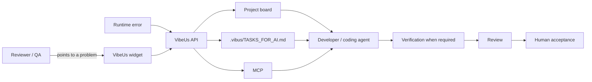

# VibeUs Product Specification

VibeUs connects the moment somebody notices a software problem with the moment a developer or coding agent receives enough context to act on it.

## Core workflow



The product is useful when a real feedback or runtime signal reaches an actionable engineering task without somebody manually reconstructing the missing page, element, viewport and diagnostic context.

## Product surfaces

### Embeddable feedback widget

The browser widget lets a reviewer describe a problem or idea and, when useful, attach it to a specific element. The captured context follows a minimum-necessary model: route/page context, viewport and selected-element information rather than arbitrary page contents.

The browser receives a Public Widget Key. Developer API and runtime-ingest credentials are separate secrets.

### Runtime Error Bridge

Backend/runtime failures can create or update grouped error signals so engineering work does not depend only on somebody seeing the UI fail first.

### Project board

Authenticated workspace users can inspect feedback, runtime errors and engineering tasks, move work through the delivery flow and perform final human Review/acceptance.

### CLI and Markdown

`npx vibus listen` keeps a local `.vibus/TASKS_FOR_AI.md` projection next to the repository so a developer or local coding tool can read the same task context.

### MCP

`npx vibus mcp` exposes structured project/task operations to compatible local development tools.

### Live Preview

`npx vibus share` can expose a local development server for temporary review. Production deployments isolate preview content from the authenticated account origin.

### Delivery integrations

A project can connect to GitHub for AI-assisted handoff, pull-request reconciliation, CI observation and guarded non-production preview delivery. VibeUs does not expose an automatic production-promotion path from this workflow.

## Task and trust model

The intended task lifecycle is:

```text
feedback/error → task → implementation → verification → Review → human acceptance
```

Important rules:

- a checked Definition of Done item is an implementation claim, not proof by itself;
- higher-risk criteria can require contract-bound verification evidence before Review;
- coding agents may implement and verify allowed criteria, but final acceptance remains a human action;
- payment redirects, browser state and client-supplied identifiers are not authoritative backend truth;
- workspace/project permissions and entitlements are enforced server-side;
- secret credentials are never meant to be embedded in the public widget.

## Non-goals

VibeUs is not intended to become:

- a general-purpose IDE;
- an autonomous code-merging agent;
- a replacement for every issue tracker or project-management system;
- a browser analytics product that captures unrelated visitor data;
- a production deployment controller.

The product should stay focused on preserving useful context across the feedback → engineering → human-acceptance loop.

## Current operational constraint

WebSocket and Live Preview connection registries currently keep active state in-process. Production/self-hosted deployments should run one Uvicorn worker until distributed realtime/tunnel coordination is implemented.

## Languages

The shipping UI currently supports English and Russian. Additional locale files are not considered supported until they are complete and human-reviewed.

## Related documentation

- [Architecture](ARCHITECTURE.md)
- [Widget integration](WIDGET_INTEGRATION.md)
- [API](API.md)
- [AI-assisted delivery](AI_ORCHESTRATION.md)
- [Self-hosting](SELF_HOSTING.md)
- [Testing](TESTING.md)
